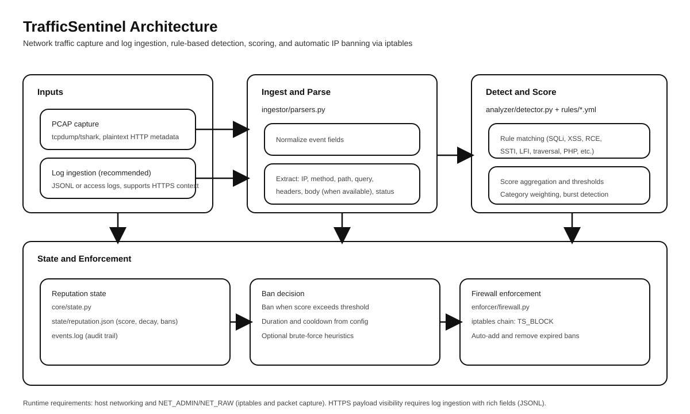

# TrafficSentinel

TrafficSentinel is a **rule-based traffic detection and automated enforcement system** designed to detect web attacks, abuse, and automated threats in real time, assign penalties, and apply firewall-based bans.

It is intentionally **simple, explainable, and deterministic**, focusing on practical security enforcement rather than opaque ML models.

TrafficSentinel operates in **two complementary modes**:

- **PCAP Capture Mode** — network-level visibility (plaintext HTTP + metadata)
- **Log Ingestion Mode (Recommended)** — full HTTPS-capable application-layer detection

---

## Core Capabilities

### What TrafficSentinel Can Detect

#### Application-Layer Attacks (HTTP / HTTPS via Logs)

TrafficSentinel detects common web vulnerabilities by matching normalized request data against compiled security rules:

- **XSS (Cross-Site Scripting)**
- **SQL Injection**
- **SSTI (Server-Side Template Injection)**
- **Command Injection / RCE**
- **Local File Inclusion (LFI)**
- **PHP-specific attacks**
- **Suspicious payload patterns**

Detection is rule-based and primarily derived from **OWASP Core Rule Set (CRS)** patterns.

---

#### Abuse & Automation Detection

- **Bruteforce attacks**
  - Per-IP, per-minute detection
  - Authentication endpoint hit-rate analysis
  - Log mode: uses HTTP status codes (401 / 403)
- **Repeated malicious request patterns**
- **Credential stuffing / password spraying**

---

#### Network-Level Metadata (PCAP Mode)

- Observes all TCP/UDP traffic
- Detects:
  - Port scanning (unique destination ports)
  - SYN flood indicators
- Inspects HTTP payloads **only when traffic is unencrypted**

---

## Operating Modes

### 1) PCAP Mode (Network Capture)

- Captures live traffic using `tcpdump` in **60-second slices**
- Parses PCAPs with `tshark`
- Extracts:
  - Source IP
  - URI
  - Headers (User-Agent, Host, Cookie)
  - Request body (when available)
- Suitable for:
  - Plain HTTP traffic
  - Local testing
  - Network-level monitoring

⚠️ HTTPS payloads are encrypted and not visible in PCAP mode.

---

### 2) Log Ingestion Mode (Recommended for HTTPS)

- Continuously tails server or application logs
- Supports:
  - Nginx access logs
  - Apache access logs
  - JSONL structured application logs
- Extracts:
  - Client IP
  - URI (path + query)
  - Response status code
  - Headers (if logged)
  - Request body (if logged)

This mode enables **full vulnerability detection on HTTPS traffic** and is the **recommended production setup**.

---

## Detection Engine

### Rules System

- **Compiled rules** generated from OWASP CRS vendor files
- **Custom rules** supported
- Rules are:
  - Regex-based
  - Categorized by vulnerability type
  - Uniformly scored (**1 point per request**)

Rules are **loaded once at startup** and reused for performance.

---

### Scoring Model

- **Per-request scoring**
  - Each request contributes **at most +1 penalty**
  - Prevents score inflation from multi-pattern matches
- Penalties accumulate across multiple malicious requests

---

## Reputation & Enforcement

### Reputation State

Stored in `state/reputation.json`, tracking per IP:

- `penalty`
- `last_seen`
- `ban_until`
- `ban_count`
- `permanent`

---

### Penalty & Ban Logic

- Penalties decay after inactivity
- Temporary ban when penalty exceeds threshold
- Permanent ban after repeated temporary bans
- Allowlisted IPs are **never penalized**

---

### Firewall Enforcement

- Uses **iptables**
- Dedicated chain: `TS_BLOCK`
- Automatically:
  - Applies bans
  - Removes expired bans
  - Prevents duplicate firewall rules

---

## Bruteforce Detection

### PCAP Mode
- Counts authentication endpoint requests per IP per minute

### Log Mode (More Accurate)
- Counts auth endpoint hits
- Uses HTTP status codes (401 / 403)
- Detects credential stuffing and password spraying

---

## Logging

TrafficSentinel produces the following logs:

- **`state/events.log`**
  - Detection events
  - IP, score, hit count, categories

- **`state/actions.log`**
  - Ban events (with reasons)
  - Unban events (expired)
  - Permanent bans

- **`state/error.log`**
  - Capture, parsing, or enforcement errors

Logs are append-only and suitable for log rotation.

---

## Rules Maintenance

### Authoritative Rule Files

- `config/rules_custom.yml` — user-defined rules
- `config/rules_compiled.yml` — auto-generated (do not edit manually)

### Updating CRS-Based Rules

```bash
python scripts/compile_rules.py
```

---

## Deployment

### Docker (Recommended)

```
docker-compose up -d
```

## Create the JSONL file on host:
```bash
sudo touch /var/log/nginx/trafficsentinel.jsonl
sudo chmod 644 /var/log/nginx/trafficsentinel.jsonl
```

### Nginx Host Logs (Recommended)

Mount:

- /var/log/nginx:/hostlogs:ro

Config:

```yaml
ingestion:
  mode: log
  log_path: /hostlogs/access.log
```

### Apache Host Logs (Alternative)

Mount:

- /var/log/apache2:/hostlogs:ro

Config:

```yaml
log_path: /hostlogs/access.log
```

### Systemd (Optional)

```
sudo cp deploy/trafficsentinel.service /etc/systemd/system/
sudo systemctl daemon-reload
sudo systemctl enable trafficsentinel
sudo systemctl start trafficsentinel
```
## ## Architecture Overview

TrafficSentinel follows a simple, modular pipeline:
```
            ┌────────────┐
            │  Traffic   │
            │(HTTP/HTTPS)│
            └─────┬──────┘
                  │
        ┌─────────▼─────────┐
        │ Capture / Ingest  │
        │  PCAP or Logs     │
        └─────────┬─────────┘
                  │
        ┌─────────▼─────────┐
        │ Normalization     │
        │ + Detection Rules │
        └─────────┬─────────┘
                  │
        ┌─────────▼─────────┐
        │ Reputation Engine │
        │ (penalty / decay) │
        └─────────┬─────────┘
                  │
        ┌─────────▼─────────┐
        │ Firewall Enforcer │
        │   (iptables)      │
        └─────────┬─────────┘

```
## Architecture Diagram




## Admin CLI

TrafficSentinel provides a built-in CLI for manual administration:

```
python cli.py show-top
python cli.py status <IP>
python cli.py unban <IP>
python cli.py clear-penalty <IP>
python cli.py allowlist ( list/ add ip/ remove ip )
```

Used for inspection, overrides, and maintenance.

## Project Structure

```
.
├── Dockerfile
├── docker-compose.yml
├── main.py                 # Orchestrator
├── cli.py                  # Admin CLI
├── agent/                  # PCAP capture
├── analyzer/               # Detection engine
├── ingestor/               # Log ingestion & bruteforce
├── enforcer/               # Firewall enforcement
├── core/                   # Reputation state logic
├── config/                 # Configuration & rules
├── deploy/                 # systemd + logrotate
├── scripts/                # Rule compilation
├── vendor/                 # OWASP CRS rules
├── state/                  # Runtime state & logs
└── pcap/                   # Temporary PCAP files
```

## Security Model & Limitations

### What TrafficSentinel Does Well

- Detects real application-layer attacks
- Handles HTTPS correctly via logs
- Applies automated enforcement safely
- Lightweight, explainable rule-based logic

### Known Limitations

- Cannot decrypt HTTPS traffic in PCAP mode
- Not a full WAF replacement
- No ML or anomaly detection (by design)
- Single-host scope (no clustering)

## Credits & Attribution

### OWASP Core Rule Set (CRS)

TrafficSentinel’s compiled detection rules are derived from the OWASP Core Rule Set.

- Source repository:
https://github.com/coreruleset/coreruleset/tree/main/rules

- Copyright and license belong to the OWASP CRS Project

- Vendor rule files under:
```
vendor/crs/rules/*
```
are included with proper attribution and are not authored by this project